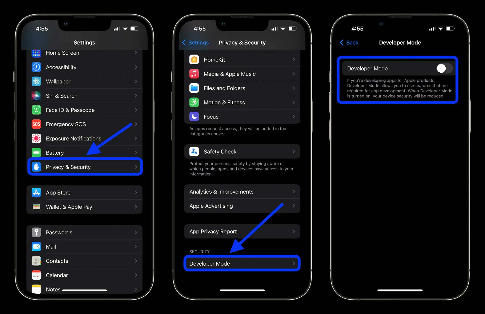

# Turning on Developer Mode
Now that you have signed a signer app, it's time to turn on Developer Mode.
1. In your Settings app, navigate to Privacy & Security.
2. At the bottom of this page should show developer mode, enter this menu
3. Flip the switch to turn your developer mode on. Now, allow your phone to restart.

Follow the instructions to set up your chosen signer:
- [Feather-Server](/guide/apps/feather-server) 
- [Feather-idevice](/guide/apps/feather-idevice)
