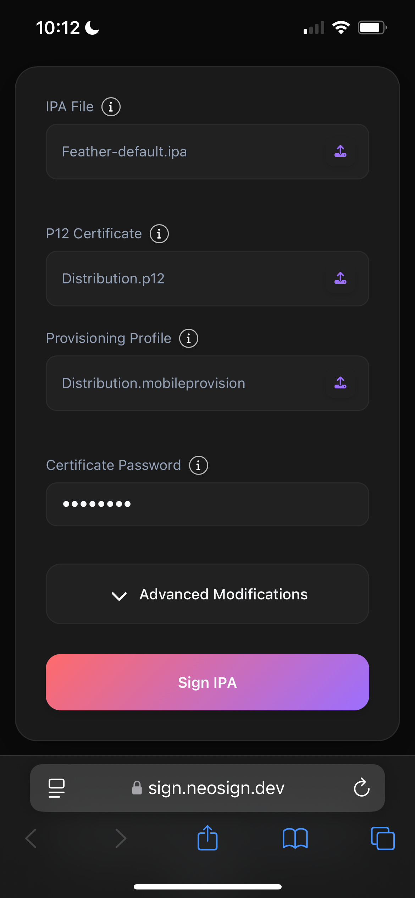

# Downloading Signing Apps to Your Device

::: info
For NeoSign customers, we provide a one-click Feather install link in the email we send containing your cert. It is recommended that you install via these links, since they are presigned with your cert.

You may continue with this guide if you aren't a NeoSign customer or are having trouble installing the app from the link.
:::

## Prerequisites

You should have received your certificate(s) in a communication from NeoSign (or another provider, if applicable) containing your cert. Save the folder containing your certificate(s) (`neosign.zip` for NeoSign users) to your Files app.
Download your chosen signing app:
- [Feather (recommended by NeoSign)](https://github.com/khcrysalis/Feather/releases/latest/download/Feather.ipa)

## Sideload Using an Online Signer
1. In the iOS Files app, unzip the folder with your development certificate. You may see different files, such as development, distribution, etc. You may choose any for this process, but make sure to use the correct `.p12` with its corresponding `.mobileprovision`.
2. Navigate to [https://sign.neosign.dev](https://sign.neosign.dev/). Select the `.ipa` file of your signer from prerequisites (or another signer if you wish, just make sure you know how to use it).
3. Select your `.p12` certificate and provisioning profile from the same folder. Enter the password found in `password.txt`.
4. Select `Sign IPA`, then select "Install".
5. Your setup should look similar to this:

Now, proceed to enable [developer mode](/guide/getting-started/developer-mode).
