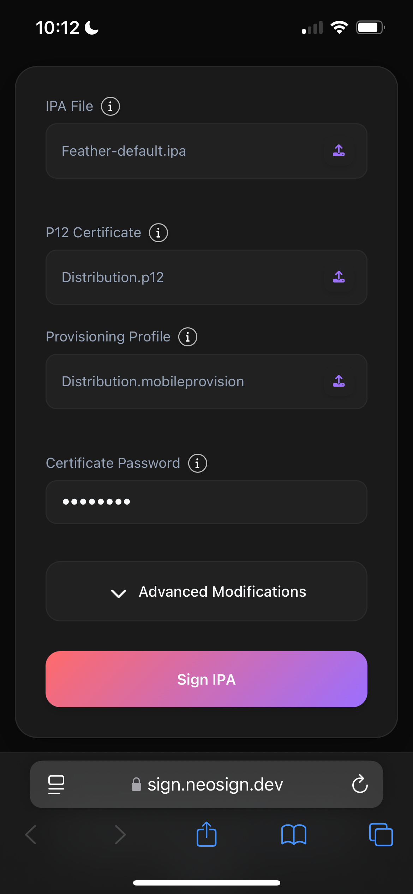

# Downloading Signing Apps to Your Device

::: info
For Neosign customers, we provide a one click Feather install link, for both Feather default, and idevice Feather, in the email we send containing your cert. It is recommended that you install via these links, since they are presigned with your cert.

You may continue with this guide if you arent a neosign customer or are having trouble installing the app.
:::

## Prerequisites

After recieving your certificates from NeoSign (or a communication from another cert provider, if applicable) containing your cert. Save your `neosign.zip` to your Files app.
Download your chosen signing app:
- [Feather](https://github.com/khcrysalis/Feather/releases/latest/download/Feather-default.ipa)
- [idevice Feather](https://github.com/khcrysalis/Feather/releases/latest/download/Feather-pairing.ipa)

::: warning
If you dont know which one to install and sideload, choose Feather default.
:::

## Sideload Using an Online Signer
1. In the iOS Files app, unzip your development certificate. You may see different files, such as development, distribution, etc. You may choose any for this process, but make sure to use the correct `.p12` with its corresponding `.mobileprovision`
2. Navigate to [https://sign.neosign.dev](https://sign.neosign.dev/). Select the IPA file of your signer from prerequisites, or another signer if you wish (there won't be documentation from us about it).
3. Select your `.p12` certificate and provisioning profile from the same folder. Enter the password found in `password.txt`.
4. Select `Sign IPA`, then select "Install".
5. Your setup should've looked like this

Now, proceed to enable [developer mode](/guide/getting-started/developer-mode).
